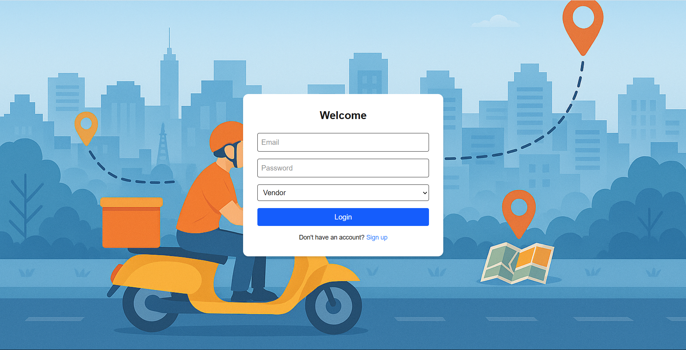
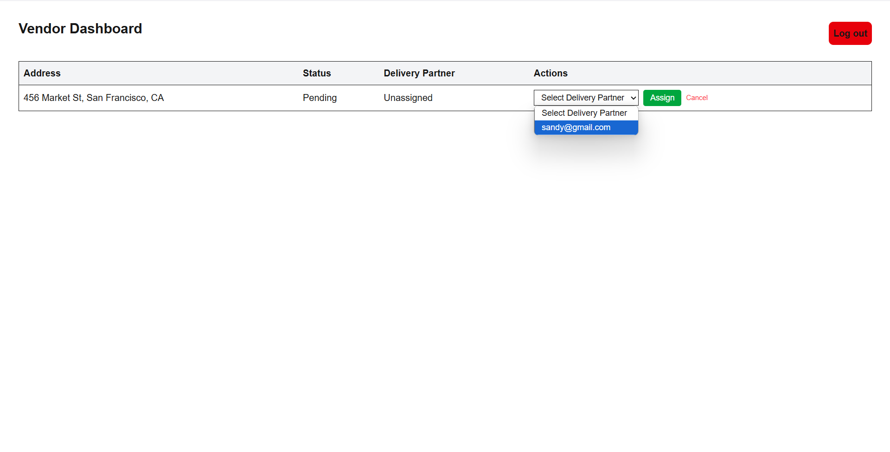
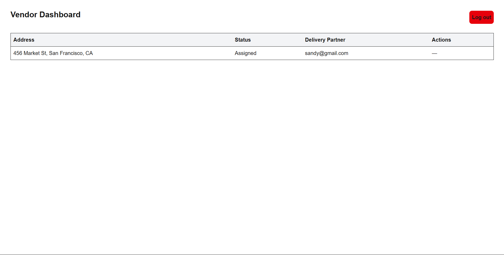
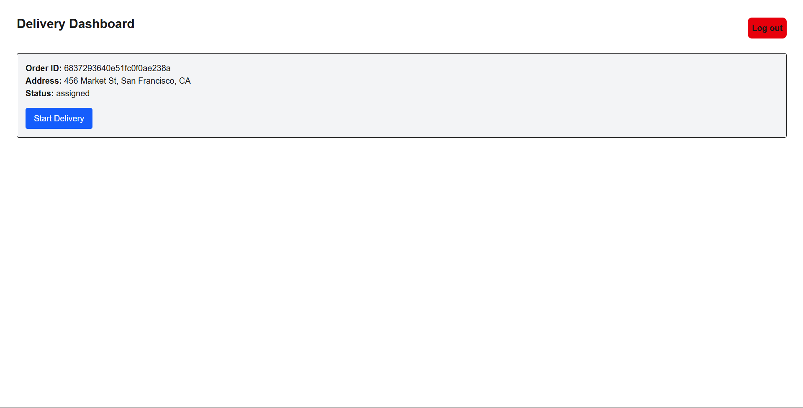
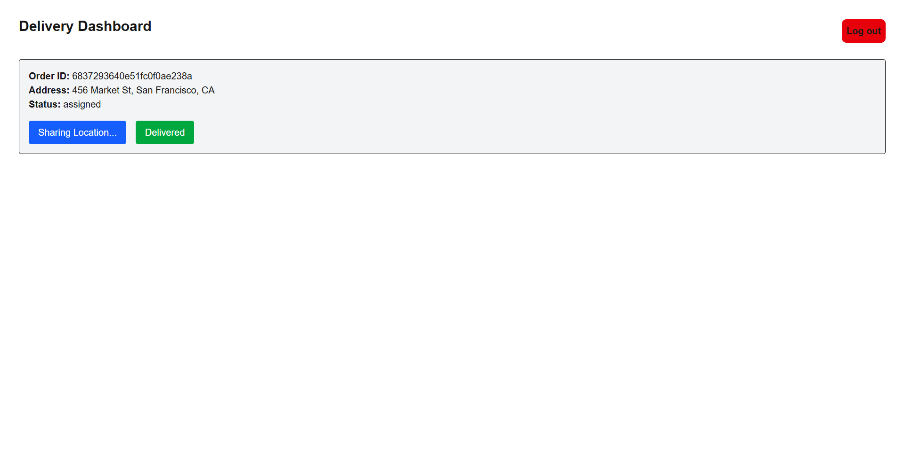
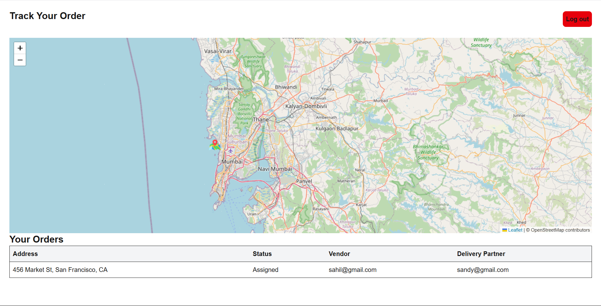
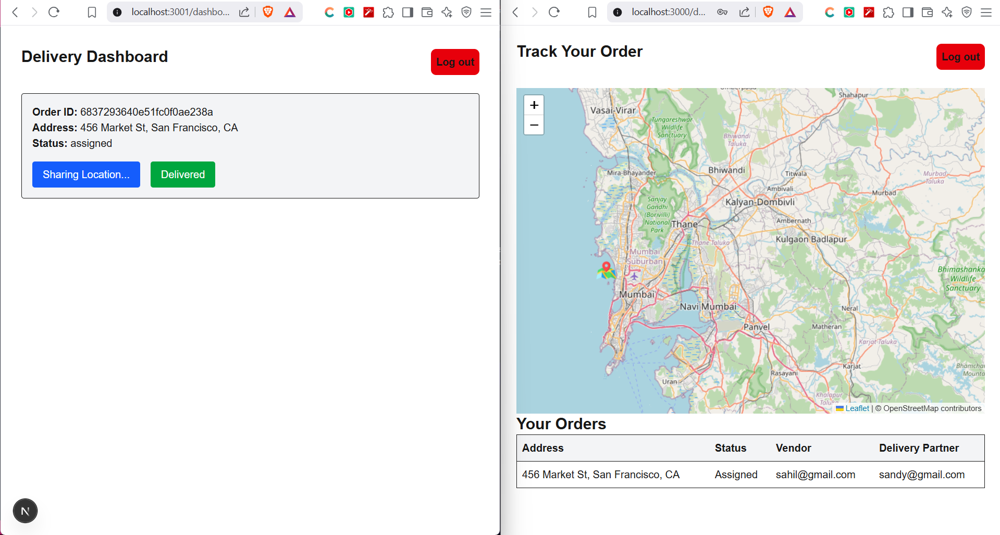

# 🚚 Real-Time Location Tracker for Multivendor Delivery Platform

A full-stack web application that enables vendors to assign delivery partners, delivery agents to share their live location, and customers to track their orders in real time — similar to apps like Dunzo or Rapido.

## 🎯 Objective

> Build a real-time location tracking system with role-based access, order assignment, and live map updates using Socket.IO and Leaflet.

---
## 🛠 Tech Stack

| Layer     | Tech                                      |
|-----------|-------------------------------------------|
| Frontend  | Next.js (App Router), TypeScript, Tailwind CSS |
| Backend   | Node.js, Express.js, TypeScript           |
| Database  | MongoDB with Mongoose                     |
| Real-Time | Socket.IO                                 |
| Map       | Leaflet.js (OpenStreetMap)                |
| Auth      | JWT with Role-Based Access                |

---
## 📸 Screenshots
### Login page


---

### Vendor order assignment



---

### Delivery partner location sharing



---

### Customer tracking map



---


 
## 📂 Project Structure
Real-Time Location Tracker for Multivendor Delivery Platform/<br>
├── client/ # Frontend (Next.js) <br>
│ ├── src/<br>
│ │ ├── app/ # App router pages (login, dashboards)<br>
│ │ ├── components/ # Reusable UI like ProtectedRoute, MapView <br>
│ └── tailwind.config.js<br>
│<br>
├── server/ # Backend (Express + TS)<br>
│ ├── src/<br>
│ │ ├── controllers/ # Auth, Orders<br>
│ │ ├── routes/ # Vendor, Delivery, Customer<br>
│ │ ├── middleware/ # JWT auth + role guard<br>
│ │ ├── sockets/ # Socket.IO handlers<br>
│ │ ├── utils/ # jwt helper <br>
│ │ ├── models/ # Mongoose schemas<br>
│ │ ├── config/ # MongoDB connection<br>
│ │ └── index.ts # Server entry<br>
│<br>
└── README.md<br>

---

## 👤 Roles & Dashboards

### ✅ Vendor
- View all of it's orders
- Assign delivery partners

### ✅ Delivery Partner
- View assigned order
- Click “Start Delivery” to share live location
- Click “Delivered” to stop sharing and mark complete

### ✅ Customer
- View list of own orders
- Track delivery partner live on Leaflet map

---

## 🛰 Live Location Tracking

- Uses **Socket.IO** on backend and frontend
- Delivery partner emits location every 3 seconds(simulated)
- Customer dashboard updates map in real time

---
## ⚙️ How to Run the Project Locally

> ✅ Prerequisites:
- Node.js ≥ 18
- MongoDB running locally (or MongoDB Atlas)
- Git

---

### 🔧 Step 1: Clone the Repository

```bash
git clone https://github.com/sahildev109/Real-Time-Location-Tracker-for-Multivendor-Delivery-Platform.git

cd Real-Time-Location-Tracker-for-Multivendor-Delivery-Platform
```

### 🗄 Step 2: Setup Backend (Express + MongoDB + Socket.IO)
```bash
cd server
npm install 
```
### 🔑 Create a .env file:
```bash
MONGO_URI=mongodb://localhost:27017/realtimelocation
JWT_SECRET=your_jwt_secret
You can also use a MongoDB Atlas URI if preferred.
```

### ▶️ Run the backend:
```bash
npm run dev
```
📍 Backend runs at: http://localhost:5000

### 🧑‍💻 Step 3: Setup Frontend (Next.js)
```bash
cd ../client
npm install
```
### ▶️ Start the frontend:
```bash
npm run dev
```
🌐 Frontend runs at: http://localhost:3000


---
## 🔐 Auth Flow
- Passwords are hashed with bcrypt

- JWT token stored in localStorage

- Role is validated using protected routes
---
## 🌍 Maps
- Implemented using Leaflet.js + OpenStreetMap

- Dynamically updates markers for delivery location


---
## 👨‍💻 Author
- **Sahil Salap**
- GitHub: sahildev109
